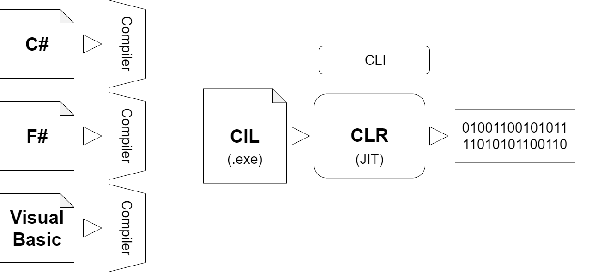

# C# Fundamental
## The Structure of a C# Program

C# is a popular high-level programming language that allows you to write computer 
programs in a human-readable format. C# is a part of the .NET Framework and benefits 
from the runtime support and class libraries provided by the .Framework.

As we know, computers need precise and complete instructions accomplish a task. These instruction sets are called computer programs or simply programs for short.

At the most basic level, computers use the binary number system to represent information 
and code. In this system, each value is represented using only two symbols, 0 and 1. 
A computer program written using the binary number system is called binary code.
Using binary code to program a computer is terse and extremely difficult to accomplish for 
any non trivial task. Thus, to simplify programming, scientists and computer engineers have 
built several levels of abstractions between computers and their human operators. These 
abstractions include software (such as operating systems, compilers, and various runtime 
systems) that takes responsibility for translating a human-readable program into a machine-readable program.

Most modern programs are written in a high-level language such as C#, Visual Basic, or Java. 
These languages allow you to write precise instructions in a human-readable form. A language 
compiler then translates the high-level language into a lower-level language that can be understood by the runtime execution system.
Each programming language provides its own set of vocabulary and grammar (also known as 
syntax). In this course, you’ll learn how to program by using the C# programming language 
on the .NET Framework. The .NET Framework provides a runtime execution environment 
for the C# program. The Framework also contains class libraries that provide a lot of reusable 
core functionality that you can use directly in your C# program

```
#KeepNote_01 | C# is a case-sensitive programming language. As a result, typing “Class” instead of “class” (for example) will result in a syntax error.  
```



```
                    # CIL => Common Intermediate Language                    # .exe => Executable
                    # CLR => Common Runtime Language                         # IDE => Integrated Development Environment
                    # CLI => Common Language Infrastructure                  # DLL => Dynamic Link Library
                    # JIT => Just In Time
```

Before Common Intermediate Language (CIL) code can be executed, it must first be 
translated for the architecture of the machine on which it will run. The .NET Framework’s 
runtime execution system takes care of this translation behind the scenes using a process 
called just-in-time compilation.

```C#
01   using System;
02
03   namespace FirstCode
04   {
05       class Program
06       {
07           static void Main(string[] args)
08           {
09              Console.WriteLine(“Hello, world!”);
10           }
11       }
12   }
```

C# program is made of one or more classes. A class is a set of data and methods. For example, the code in Fiqure 1-3 defines a single class named Program on lines 5 through 11. A class is defined by using the keyword class followed by the class name. The contents of a class are defined between an opening brace ({) and a closing brace (}).

Line 3 of the code in Figure 1-3 defines a namespace, FirstCode. Namespaces are used to organize classes and uniquely identify them. The namespace and the class names are combined together to create a fully qualified class name. For example, the fully qualified class name for the class Program is FirstCode.Program. C# requires that the fully qualified name of a class be unique. As a result, you can’t have another class by the name Program in the namespace FirstCode, but you can have a class by the name Program in another namespace, say, SecondCode. Here, the class Program defined in the namespace SecondCode is uniquely identified by its fully qualified class name, SecondCode.Program.

The .NET Framework provides a large number of useful classes organized into many 
namespaces. The System namespace contains some of the most commonly used base classes. 
One such class in the System namespace is Console. The Console class provides functionality 
for console application input and output. The line 9 of the code in Figure 1-3 refers to the 
Console class and calls its WriteLine method. To access the WriteLine method in an unambiguous way, you must write it like this:

System.Console.WriteLine(“Hello, world!”);

Because class names frequently appear in the code, writing the fully qualified class name every 
time will be tedious and make the program verbose. You can solve this problem by using the 
C# using directive (see the code in line 1 in Figure 1-3). The using directive allows you to use 
the classes in a namespace without having to fully qualify the class name.

The Program class defines a single method by the name Main (see lines 7 to 10 of the code 
listing in Figure 1-3). Main is a special method in that it also serves as an entry point to the 
program. When the runtime executes a program, it always starts at the Main method

A program can have many classes and each class can have many methods, but it should have only one Main method. A method can in turn call other methods. In line 9, the Main method is calling the WriteLine method of the System.Console class to display a string of characters on the command window—and that’s how the message is displayed.

```
#KeepNote_02 | Every C# statement must end with a semicolon (;).

#KeepNote_03 | The Main method must be declared as static. A static method is callable on a class even when no instance of the class has been created.
```

## The Variables

`Variables provide temporary storage during the execution of a program.`
The variables in C# are placeholders used to store values. A variable has a name and a data 
type. A variable’s data type determines what values it can contain and what kind of operations may be performed on it. For example, the following declaration creates a variable named 
number of the data type int and assigns a value of 10 to the variable:
```C#
int number = 10;
```
When a variable is declared, a location big enough to hold the value for its data type is 
created in the computer memory. For example, on a 32-bit machine, a variable of data type 
int will need two bytes of memory. The value of a variable can be modified by another assignment, such as:
```C#
number = 20;
```
The above code changes the contents of the memory location identified by the name number

## The Constants

`Constants are data fields or local variables whose value cannot be modified.`
Constants are declared by using the const keyword. For example, a constant can be declared 
as follows:
```C#
const int i = 10;
```
This declares a constant i of data type int and stores a value of 10. Once declared, the value 
of the constant cannot be changed.

## The Data Types

Data types specify the type of data that you work with in a program. The data type defines the size of memory needed to store the data and the kinds of operations that can be performed on the data, Each Data Type is a class. Variables C# are categorized into wo types:
- Value type
- Reference type

### Value Type

C# provides several built-in data types that you can use in your programs. You can also define 
new types by defining a data structure, such as a class or a struct. This chapter focuses on 
some of the most commonly used built-in data types.
Table 1-3 lists several commonly used built-in data types available in C#. The sizes listed in 
the table refer to a computer running a 32-bits operating system such as Windows 7, 32-bit. 
For a 64-bits operating system, such as Windows 7 64-bit, these sizes will be different.

| Data Types | Size | Range of Values |
|--|--|--|
| byte | 1 byte | 0 to 255
| char | 2 bytes | U +0000 to U +ffff (Unicode characters)
| short | 2 bytes | -32,768 to 32,767
| int | 4 bytes | 2,147,483,648 to 2,147,483,647
| long | 8 bytes | 9,223,372,036,854,775,808 to 9,223,372,036,854,775,807
| float | 4 bytes | 1.5  10-45 to 3.4  1038
| double | 8 bytes | (+/-)5.0 x 10-324  to (+/-)1.7 x 10308
| bool | 2 bytes | True or false
| string | - | Zero or more Unicode characters
| decimal || (-7.9 x 1028  to 7.9 x 1028) / 100  to 28 |
| sbyte || -128 to 127|
| enum |||
| struct |||

All the data types listed in Table 1-3 are value types except for string, which is a reference 
type. The variables that are based directly on the value types contain the value. In the case 
of the reference type, the variable holds the address of the memory location where the actual 
data is stored. Value type uses stack  memory, so if we a and b value type each other, a copy of the value of a is sent to b. That is, it does not connect the memories.

```C#
    int a = 3;

    int b = a;

    a = 4;

    Console.WriteLine($"a: {a}");
    Console.WriteLine($"b: {b}");

    // We can see
    // a: 4
    // b: 3
```

```
#KeepNote_04 | Commonly used built-in data types in C#

#KeepNote_05 | The unsigned versions of short, int, and long are ushort, uint, and ulong, respectively. The unsigned types have the same size as their signed versions but store much larger ranges of only positive values.
```

### Reference Type
All types except the Reference Type value type belong to the Reference type. The usage value of the reference type is stored in the Heap memory. The name of those variables and the link to the value in the Heap memory are stored in the stack memory. Example information about the reference type:
- `string`
- `class`
- `interface` etc.

If we combine item_b reference type item_a reference type then the heap memory links are the same and the values are the same as a result.
```C#
class Program
    {
        static void Main(string[] args)
        {
            // Referance Type
            Item item_a = new Item();
            Item item_b = new Item();
            item_a.number = 3;
            item_b = item_a;
            item_a.number = 4;
            Console.WriteLine(item_a.number); //4
            Console.WriteLine(item_b.number); //4
        }
    }
    class Item
    {
        public int number;
    }
```

## Arrays in C#

`An array is a collection of items in which each item can be accessed by using a unique index.`

An array in C# is commonly used to represent a collection of items of similar type. A sample 
array declaration is shown in the following code:
int[] numbers = { 1, 2, 3, 4, 5 };
This declaration creates an array identified by the name numbers. This array is capable of 
storing a collection of five integers. This declaration also initializes each of the array items 
respectively by the numbers 1 through 5.
Any array item can be directly accessed by using an index. In the .NET Framework, array 
indexes are zero-based. This means that to access the first element of an array, you use the 
index 1; to access the second element, you use the index 2, and so on.
To access an individual array element, you use the name of the array followed by the index 
enclosed in square brackets. For example, numbers[0] will return the value 1 from the above declared array, and numbers[4] will return the value 5. It is illegal to access an array outside its defined boundaries. For example, you’ll get an error if you try to access the array element numbers[5].

## Operators in C#

`Operators are symbols that specify which operation to perform on the operands before returning a result`

