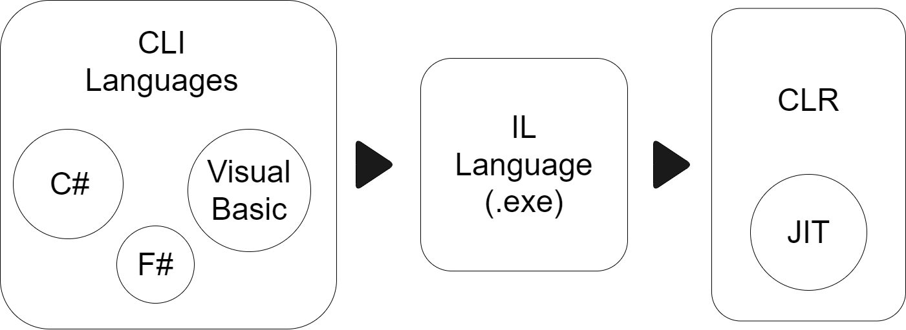

# The Structure of a C# Program

C# is a popular high-level programming language that allows you to write computer 
programs in a human-readable format. C# is a part of the `.NET Framework` and benefits 
from the runtime support and class libraries provided by the .Framework.

As we know, computers need precise and complete instructions accomplish a task. These instruction sets are called computer programs or simply programs for short.

At the most basic level, computers use the binary number system to represent information 
and code. In this system, each value is represented using only two symbols, 0 and 1. 
A computer program written using the binary number system is called binary code.
Using binary code to program a computer is terse and extremely difficult to accomplish for 
any non trivial task. Thus, to simplify programming, scientists and computer engineers have 
built several levels of abstractions between computers and their human operators. These 
abstractions include software (such as operating systems, compilers, and various runtime 
systems) that takes responsibility for translating a human-readable program into a machine-readable program.

Most modern programs are written in a high-level language such as C#, Visual Basic, or Java. 
These languages allow you to write precise instructions in a human-readable form. A language 
compiler then translates the high-level language into a lower-level language that can be understood by the runtime execution system.
Each programming language provides its own set of vocabulary and grammar (also known as 
syntax). In this course, you’ll learn how to program by using the C# programming language 
on the .NET Framework. The .NET Framework provides a runtime execution environment 
for the C# program. The Framework also contains class libraries that provide a lot of reusable 
core functionality that you can use directly in your C# program

```
                                                         #KeepNote_01

                                            C# is a case-sensitive programming language. 
                        As a result, typing “Class” instead of “class” (for example) will result in a syntax error. 
```
<div style="display: flex; justify-content: center; text-align: center;padding: 5% 0px;">
     
</div>

```
                    # IL => Intermediate Language                            # .exe => Executable
                    # CLR => Common Runtime Language                         # IDE => Integrated Development Environment
                    # JIT => Just In Time                                    # DLL => Dynamic Link Library
```

Before Common Intermediate Language (CIL) code can be executed, it must first be 
translated for the architecture of the machine on which it will run. The .NET Framework’s 
runtime execution system takes care of this translation behind the scenes using a process 
called just-in-time compilation.

```
01   using System;
02
03   namespace FirstCode
04   {
05       class Program
06       {
07           static void Main(string[] args)
08           {
09              Console.WriteLine(“Hello, world!”);
10           }
11       }
12   }
```

C# program is made of one or more classes. A class is a set of data and methods. For example, the code in Fiqure 1-3 defines a single class named Program on lines 5 through 11. A class is defined by using the keyword class followed by the class name. The contents of a class are defined between an opening brace ({) and a closing brace (}).

Line 3 of the code in Figure 1-3 defines a namespace, FirstCode. Namespaces are used to organize classes and uniquely identify them. The namespace and the class names are combined together to create a fully qualified class name. For example, the fully qualified class name for the class Program is FirstCode.Program. C# requires that the fully qualified name of a class be unique. As a result, you can’t have another class by the name Program in the namespace FirstCode, but you can have a class by the name Program in another namespace, say, SecondCode. Here, the class Program defined in the namespace SecondCode is uniquely identified by its fully qualified class name, SecondCode.Program.

The .NET Framework provides a large number of useful classes organized into many 
namespaces. The System namespace contains some of the most commonly used base classes. 
One such class in the System namespace is Console. The Console class provides functionality 
for console application input and output. The line 9 of the code in Figure 1-3 refers to the 
Console class and calls its WriteLine method. To access the WriteLine method in an unambiguous way, you must write it like this:

System.Console.WriteLine(“Hello, world!”);

Because class names frequently appear in the code, writing the fully qualified class name every 
time will be tedious and make the program verbose. You can solve this problem by using the 
C# using directive (see the code in line 1 in Figure 1-3). The using directive allows you to use 
the classes in a namespace without having to fully qualify the class name.

The Program class defines a single method by the name Main (see lines 7 to 10 of the code 
listing in Figure 1-3). Main is a special method in that it also serves as an entry point to the 
program. When the runtime executes a program, it always starts at the Main method

A program can have many classes and each class can have many methods, but it should have only one Main method. A method can in turn call other methods. In line 9, the Main method is calling the WriteLine method of the System.Console class to display a string of characters on the command window—and that’s how the message is displayed.

```
                         #KeepNote_02                                                  #KeepNote_03

                    Every C# statement must                             The Main method must be declared as static. 
                    end with a semicolon (;).                           A static method is callable on a class even
                                                                        when no instance of the class has been created.
```


Second Section Progressing . . .